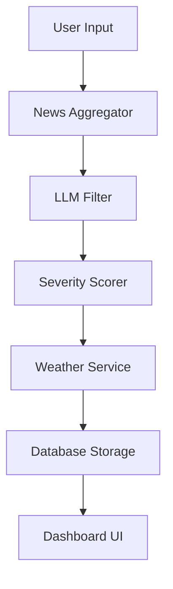

# GeoTrade AI - Geopolitical Risk Assessment System

A comprehensive AI-powered system to assess the impact of geopolitics, news, and weather on importing operations.

## Features

- 📰 **Multi-Source News Aggregation**: Fetches relevant news from NewsAPI and GNews
- 🤖 **AI-Powered Filtering**: Uses Ollama local LLM to filter and analyze news relevance
- 📊 **Severity Scoring**: Intelligent risk assessment with 1-10 severity scale
- 🌦️ **Weather Impact Analysis**: Monitors weather conditions affecting logistics
- 📈 **Visual Dashboard**: Beautiful Bootstrap-based interface with real-time insights
- 💾 **Historical Tracking**: SQLite database for assessment history

## Prerequisites

- Python 3.8+
- [Ollama](https://ollama.ai/) installed and running
- API keys for:
  - [NewsAPI](https://newsapi.org/) (free tier available)
  - [GNews](https://gnews.io/) (free tier available)
  - [OpenWeatherMap](https://openweathermap.org/api) (free tier available)

## Installation

### 1. Install Ollama

Download and install Ollama from [https://ollama.ai/](https://ollama.ai/)

Pull a model (recommended: llama3.2, mistral, or phi3):
```bash
ollama pull llama3.2
```

Verify Ollama is running:
```bash
ollama list
```

### 2. Clone or Download the Project

Navigate to the project directory:
```bash
cd "c:\Users\najib\Desktop\geotrade ai"
```

### 3. Install Python Dependencies

```bash
pip install -r requirements.txt
```

### 4. Configure Environment Variables

Copy the example environment file:
```bash
copy .env.example .env
```

Edit `.env` and add your API keys:
```env
NEWSAPI_KEY=your_newsapi_key_here
GNEWS_API_KEY=your_gnews_api_key_here
OPENWEATHER_API_KEY=your_openweather_api_key_here

OLLAMA_MODEL=llama3.2
OLLAMA_BASE_URL=http://localhost:11434
```

## Getting API Keys

### NewsAPI
1. Go to [https://newsapi.org/](https://newsapi.org/)
2. Click "Get API Key"
3. Sign up for free account
4. Copy your API key

### GNews
1. Go to [https://gnews.io/](https://gnews.io/)
2. Click "Sign Up"
3. Create free account
4. Copy your API key from dashboard

### OpenWeatherMap
1. Go to [https://openweathermap.org/api](https://openweathermap.org/api)
2. Click "Sign Up"
3. Create free account
4. Go to API keys section
5. Copy your API key

## Usage

### Start the Application

```bash
python app.py
```

The application will start on `http://localhost:5000`

### Using the Dashboard

1. **Enter Product**: What you're importing (e.g., "Electronics", "Textiles")
2. **Enter Country**: Source country (e.g., "China", "India")
3. **Select Period**: Analysis timeframe (3-30 days)
4. **Click "Analyze Risk"**: The system will:
   - Fetch relevant news articles
   - Filter using AI for relevance
   - Score severity of each event
   - Analyze weather impact
   - Generate comprehensive risk assessment

### Understanding Results

- **Overall Risk**: Low / Medium / High / Critical
- **Risk Score**: 1-10 numerical score
- **Top Concerns**: Most critical issues identified
- **Recommended Actions**: Suggested steps to mitigate risks
- **Detailed Events**: Full analysis of each news article with:
  - Relevance score
  - Severity score
  - Category (supply_chain, regulatory, economic, security, weather)
  - Impact timeline
  - Specific recommendations

## Project Architecture

The project contains two distinct implementations:

1.  **Monolithic CLI (`main.py`)**: A self-contained script (PortNet Edition) that handles the entire pipeline—from news aggregation to operational risk scoring for the Moroccan ecosystem.
2.  **Modular Web App (`geotrade_core/`)**: A Flask-based application structured for scalability and maintainability.

---

## 🛠️ Core Components (Web App)

### 1. Services (`geotrade_core/services/`)
- **News Aggregator**: Integrates with **NewsAPI** and **GNews** to fetch real-time information.
- **LLM Filter**: Uses **Ollama** (locally hosted LLM) to filter news articles for relevance based on product and source country.
- **Severity Scorer**: Assesses the impact of relevant events using LLM prompts tuned for Moroccan trade routes and logistics.
- **Weather Service**: Integrates with **WeatherAPI.com** to provide rule-based risk scoring for weather-related disruptions.

### 2. Data Management
- **Database (`geotrade_core/models/database.py`)**: A lightweight JSON-based storage for persistence (replaces the original SQLite implementation for simpler deployment).
- **Configuration (`geotrade_core/config.py`)**: Centralized management for API keys and environment variables.

### 3. Utilities (`geotrade_core/utils/`)
- **Prompts**: Specialized prompt templates optimized for Moroccan port logistics (Tangier Med, Casablanca) and trade relations.
- **Helpers**: Shared logic for text cleaning, deduplication, and JSON parsing from LLM responses.

---

## 🔄 Data Flow



## 🔍 Key Insights

- **Morocco Optimization**: The system is specifically calibrated to consider shipping routes like the Strait of Gibraltar and major Moroccan ports.
- **Hybrid AI Approach**: Uses local LLMs (Ollama) to ensure data privacy and reduce API costs, while leveraging high-quality news sources.
- **Risk Multi-Factor**: Combines news-based geopolitical analysis with real-time weather alerts for a multi-dimensional risk model.

## Project Structure

```
geotrade ai/
├── main.py                      # PortNet Edition (Monolithic CLI)
├── app.py                      # Main Flask application
├── requirements.txt            # Python dependencies
├── .env.example               # Environment variables template
├── data/                       # JSON data storage
│   └── portnet_assessments.json # Analysis history
│
├── geotrade_core/
│   ├── app.py                  # Core Flask app logic
│   ├── config.py               # Configuration management
│   ├── models/
│   │   └── database.py         # JSON storage handler
│   ├── services/
│   │   ├── news_aggregator.py  # News fetching
│   │   ├── weather_service.py  # Weather data
│   │   ├── llm_filter.py      # LLM-based filtering
│   │   └── severity_scorer.py  # Risk assessment
│   └── utils/
│       ├── prompts.py          # LLM templates
│       └── helpers.py          # Utilities
└── static/ & templates/       # Frontend assets
```

## Troubleshooting

### Ollama Connection Issues

**Error**: "Cannot connect to Ollama"

**Solution**:
1. Ensure Ollama is running: `ollama list`
2. Check the base URL in `.env` (default: `http://localhost:11434`)
3. Verify the model is installed: `ollama pull llama3.2`

### API Rate Limits

**Issue**: "No news articles found"

**Solution**:
- Free tier API limits:
  - NewsAPI: 100 requests/day
  - GNews: 100 requests/day
- Consider upgrading to paid tier for production use
- Use longer analysis periods (7-30 days) to get more results per request

### Slow Analysis

**Issue**: Analysis takes too long

**Solution**:
- Use a smaller, faster Ollama model (e.g., `phi3`)
- Reduce the analysis period
- Limit the number of articles processed (edit `Config.MAX_NEWS_RESULTS` in `config.py`)

## Customization

### Change Ollama Model

Edit `.env`:
```env
OLLAMA_MODEL=mistral
```

Then pull the model:
```bash
ollama pull mistral
```

### Adjust Severity Thresholds

Edit `config.py`:
```python
SEVERITY_LOW = 3
SEVERITY_MEDIUM = 6
SEVERITY_HIGH = 8
```

### Modify LLM Prompts

Edit prompts in `utils/prompts.py` to customize how the AI analyzes news.

## License

This project is for educational and personal use.

## Support

For issues or questions, please check:
- Ollama documentation: [https://ollama.ai/](https://ollama.ai/)
- Flask documentation: [https://flask.palletsprojects.com/](https://flask.palletsprojects.com/)
- Bootstrap documentation: [https://getbootstrap.com/](https://getbootstrap.com/)
